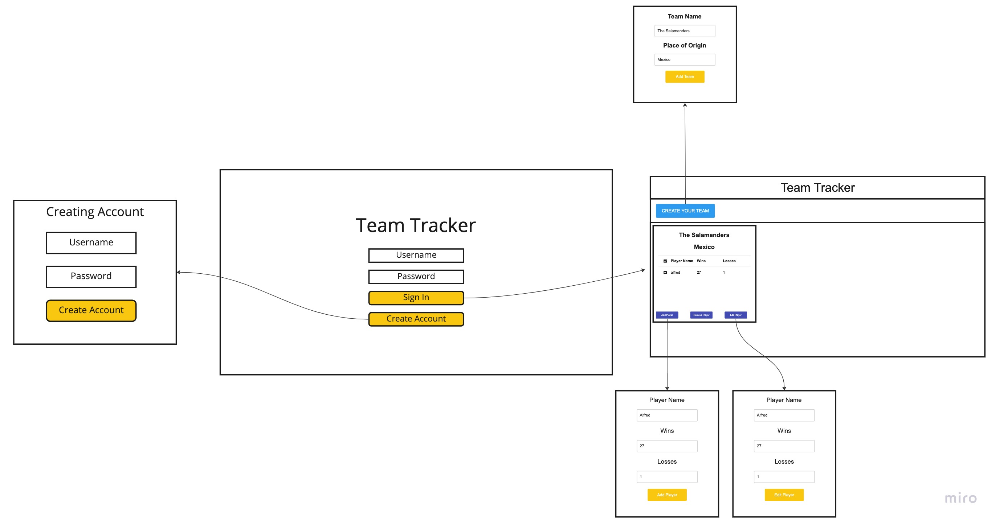
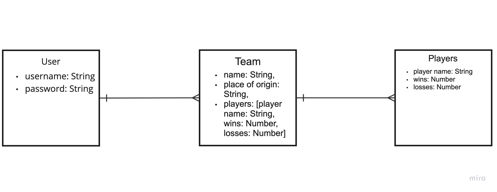

# Project-2-server

# Soccer Team Tracker

## Project planning for Soccer Team Tracker

Wireframe:

## User Stories

MVP
- As a user, I want to be able to sign in
- As a user, I want to be able to sign out
- As a user, I want to be able to sign up
- As a user, I want to make a team
- As a user, I want to add team wins
- As a user, I want to add team losses
- As a user, I want to be able to players to a team
- As a user, I want to add player wins
- As a user, I want to add player losses

Version 2
- As a user, I want to be able to change my account information
- As a user, I want to have an account page
- As a user, I want to add pictures to the players
- As a user, I want to add deeper player stats

Version 3
- As a user, I want to share my team on social media
- As a user, I want to add pictures to the players
- As a user, I want to be able track professional player stats in real-time
- As a user, I want to compare my team with professional teams

 ## ERD

 